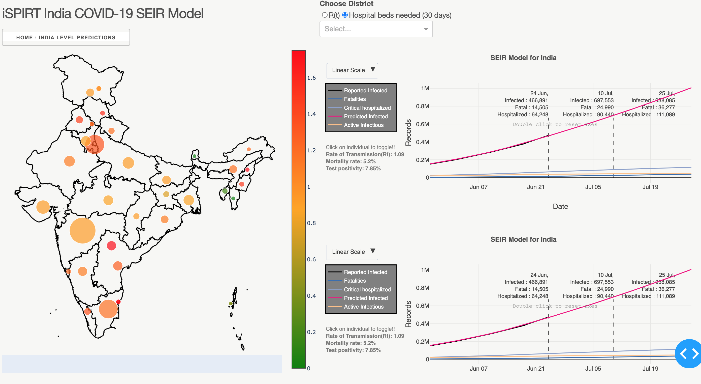

[](https://gitpod.io/#https://github.com/seirforindia/seirdistrictmodel.git) 

# Covid19 SEIR Model for India and districts in India

## About this app

Implements a Network SEIR compartmental Model for forecasting COVID in India.

## Requirements

* Python 3
* AWS Account With S3 permission

# Create S3 Buckets

Set following environment variables 
```
    ACCESS_KEY: "",
    SECRET_KEY: "",
    OPTIMIZER_ACCESS_KEY: "",
    OPTIMIZER_SECRET_KEY: "",
```

open setup.py and add names of 3 buckets which will be used to store processed files and run the script:
```
    python setup.py    
```

## Resource Configuration
Set custom configuration in config/resource.ini and should add same bucket names defined in above step.


## Building Model

Following dataset is used to build model:
```
https://api.covid19india.org/districts_daily.json
https://api.covid19india.org/csv/latest/statewise_tested_numbers_data.csv
https://api.covid19india.org/csv/latest/state_wise_daily.csv
https://api.covid19india.org/csv/latest/state_wise.csv
https://api.covid19india.org/csv/latest/district_wise.csv
```

build model locally by running below command:
```
python -m core.seir.py
```

Once the model is successfully build it will upload  data files to configured buckets.

## How to run this app


We suggest you to create a virtual environment for running this app with Python 3. Clone this repository 
and open your terminal/command prompt in the root folder.

```
git@github.com:seirforindia/seirdistrictmodel.git
cd seirdistrictmodel
python3 -m virtualenv venv

```
In Unix system:
```
source venv/bin/activate

```
In Windows: 

```
venv\Scripts\activate
```

Install all required packages by running:
```
pip install -r requirements.txt
```

Set following environment Variables:


Run this app locally by:

```
python app.py
```

Click on individual state from choropleth map to visualize state-specific flight delays in other plots and datatable, drag along time-series, click on 
single bar or drag along scatters to know flight details in the table. 


## Create Your Own Model [SEIR Model](https://en.wikipedia.org/wiki/Compartmental_models_in_epidemiology)
 
For Creating custom zone your must create global and nodal config with custom values. The global and nodal config has 


## Model Configuration
### Global config

```json
{
  "pop_frac": [0.44, 0.35, 0.15, 0.06],
  "rate_frac": [1, 1, 1, 1],
  "rates": 2.3,
  "param": [
    {
      "intervention_date": "04-02-2020",
      "rate_frac": [0.2, 0.2, 0.2, 0.2],
      "intervention_type": "global"
    }
  ],
  "CFR": [0.01,0.065,0.125,0.25],
  "P_SEVERE": [0.15, 0.35, 0.6, 0.9],
  "I0": 50,
  "E0": 75,
  "D_death": 14,
  "D_hospital_lag": 5,
  "D_incubation": 5.2,
  "D_infectious": 2.9,
  "D_recovery_mild": 11.1,
  "D_recovery_severe": 28.6,
  "Fatal0": 0,
  "Mild0": 0,
  "R0": 0,
  "R_Fatal0": 0,
  "R_Mild0": 0,
  "R_Severe0": 0,
  "S0": -1,
  "Severe0": 0,
  "Severe_H0": 0
}
```

### Nodal Config
```json
{
    "node": "Delhi Cantonment",
    "pop": 116352,
    "nodal_param_change": [
      {
        "intervention_date": "04-03-2020",
        "intervention_type": "local",
        "delI": 20,
        "rate_frac": [0.4, 0.4, 0.4, 0.4]
      }
    ]
  }
```

### Global Config parameters Description
```text
pop_frac: population fractions of different age groups: [0-19,20-39,40-59,60+]

rate_frac: rate multiplier of different age groups (default value of 1 corresponds to a rate of ~2.3)

rates: basic reproduction number R0 is the number of secondary infections each infected individual produces (largest eigenvalue chosen from the 4×4 matrix used to model the four age categories)

param: global intervention is a time event that impacts the parameters of the simulation (for eg: lockdown)

intervention_date: date when intervention was put in place

intervention_type: distinguishes between global and nodal interventions

intervention_day: number of days after which the intervention was put in place (void from latest version)

CFR: case fatality rate of different age groups (percentage of infected people who pass away)

P_SEVERE: hospitalization rate of different age groups (percentage of infected people who need to be hospitalized)

I0: initial number of infectious persons at the start of the simulation

E0: initial number of exposed persons at the start of the simulation

D_death: average time duration an individual takes to move from infection to death

D_hospital_lag: average time duration for an infected person to be hospitalised (assuming the individual is hospitalised)

D_incubation: time duration an exposed person incubates for before getting infected

D_infectious: time duration an infectious individual (symptomatic and asymptomatic) is shedding the virus

D_recovery_mild: recovery time for mild cases (non-hospitalised individuals)

D_recovery_severe: average length of stay in a hospital for severe cases

Fatal0: initial number of fatal persons at the start of the simulation

Mild0: initial number of recovering mild cases at the start of the simulation

R0: initial number of removed persons (recovered or dead) at the start of the simulation

R_Fatal0: initial number of removed fatal cases at the start of the simulation

R_Mild0: initial number of removed mild cases at the start of the simulation

R_Severe0: initial number of removed hospitalized cases at the start of the simulation

S0: initial number of susceptible persons (number of people who are not immune to the disease at the start of the simulation, typically encompasses the entire population)

Severe0: initial number of severe cases recovering at home at the start of the simulation
```

### Nodel configuration parameters description:
```

node: name of the node ie the geographical boundary for which the simulation is executed

t0: offset value ie the starting day for the specific simulation in comparison to the simulation’s reference

pop: total population within the node’s geographic boundary

nodal_param_change: node-wise interventions ie time events that impacts only the geographical area for which the node is defined

intervention_date: date when intervention was put in place

intervention_type: distinguishes between global and nodal interventions

intervention_day: number of days after which the intervention was put in place

rate_frac: rate multiplier of different age groups (default value of 1 corresponds to a rate of ~2.3)
```

## Screenshot & Screencast




## Resources

* [Dash](https://dash.plot.ly/)

