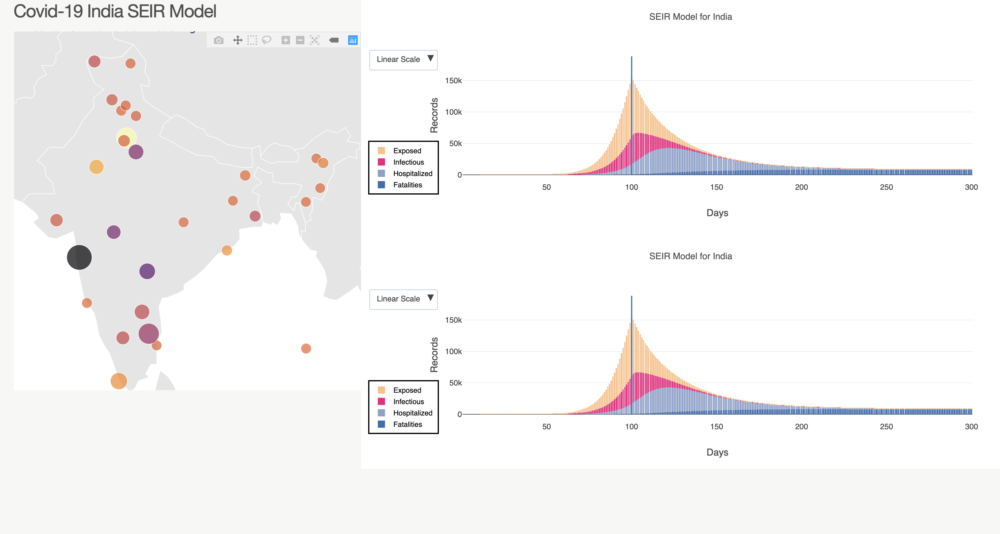

[](https://gitpod.io/#https://github.com/seirforindia/seirdistrictmodel.git) 

# Covid19 SEIR Model for India and districts in India

## About this app

Implements a Network SEIR compartmental Model for forecasting COVID in India.


## Requirements

* Python 3

## How to run this app


We suggest you to create a virtual environment for running this app with Python 3. Clone this repository 
and open your terminal/command prompt in the root folder.

```
git@github.com:seirforindia/seirdistrictmodel.git
cd seirdistrictmodel
python3 -m virtualenv venv

```
In Unix system:
```
source venv/bin/activate

```
In Windows: 

```
venv\Scripts\activate
```

Install all required packages by running:
```
pip install -r requirements.txt
```

Run this app locally by:
```
python app.py
```

Click on individual state from choropleth map to visualize state-specific flight delays in other plots and datatable, drag along time-series, click on 
single bar or drag along scatters to know flight details in the table. 

## Screenshot & Screencast




## Resources

* [Dash](https://dash.plot.ly/)
